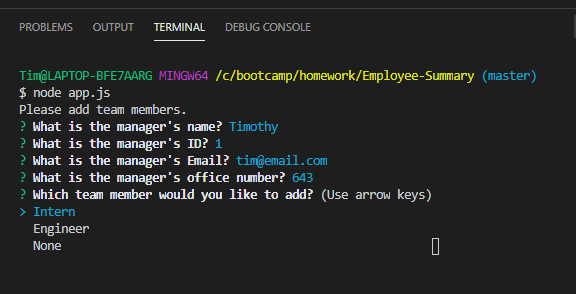
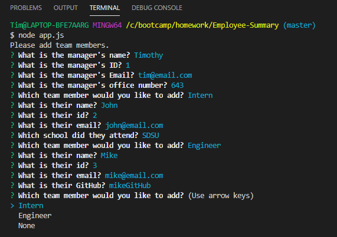
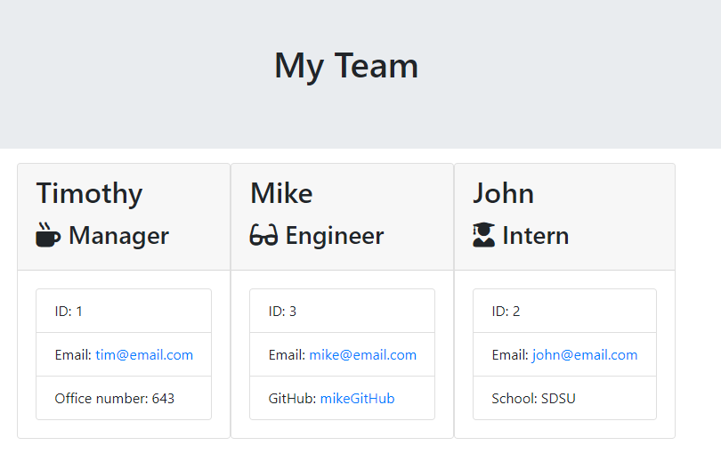

# Employee-Summary

This application allows you to build a dream team of developers right in the command line! Based off a series of prompts, your team will consist of 1 manager and as many engineers and interns as you want.

## How it works

This is a node.js application that takes command line input to create a team of developers that renders onto an HTML page. An initial employee constructor was first created to allow the other team member constructors to inherit it's properties. The 3 other constructors that were created were Manager, Engineer, and Intern. A CLI constructor was created to store the team member objects in an array to later render into new HTML document. In order to create new team members, the user is asked to answer prompts on the command line.

## Concepts Used

- Node.js and Command line interface
- Using inquierer, fs, path, util node modules
- Class constructors and inheritance
- Promises
- Test Driven Development with Jest

## How it looks

;
;
;
